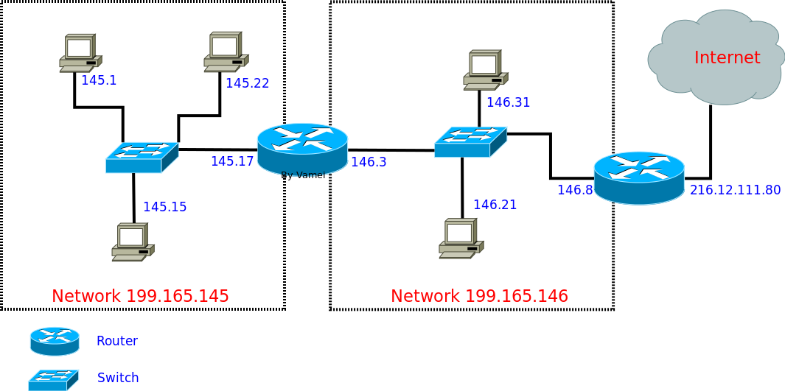

#IP接力赛 IP, ARP, RIP和BGP协议
网络层`(network layer)`是实现互联网最重要的一层。正是在网络层面上，各个局域网根据IP协议相互连接，最终构成覆盖全球的Internet。更高层的协议，无论是TCP还是UDP，必须通过网络层的IP数据包`(datagram)`来传递信息。操作系统也会提供该层面的套接字`(socket)`，从而允许用户直接操作IP包。

IP数据包简称为IP包。它是符合IP协议的0/1序列。信息包含在这一序列中。IP包分为头部`(header)`和数据`(Data)`两部分。数据部分是要传送的信息，头部是为了能够实现传输而附加的信息。

> 这与以太网帧的头部功能相类似,如果对帧感到陌生，可参看小喇叭一文。

##IP包的格式
IP协议可以分为IPv4和IPv6两种。IPv6是改进版本，用于在未来取代IPv4协议。我们可以暂时忽略两者的区别，只以IPv4为例。下面是IPv4的格式

&img IPv4包 我们按照4 bytes为单位，将整个序列折叠，以便更好的显示

与帧类似，IP包的头部也有多个区域。我们将注意力放在红色的发出地`(source address)`和目的地`(destination address)`。它们都是IP地址。IPv4的地址为4 bytes的长度(也就是32位)。我们通常将IPv4的地址分为四个十进制的数，每个数的范围为0-255,比如192.0.0.1就是一个IP地址。填写在IP包头部的是该地址的二进制形式。

IP地址是全球地址，它可以识别"社区"`(局域网)`和"房子"`(主机)`。这是通过将IP地址分类实现的。

|IP class   | From        |  To              |  Subnet Mask   |
|---        |---          |---               |---             |
|A          | 1.0.0.0     |  126.255.255.255 |  255.0.0.0     |
|B          | 128.0.0.0   |  191.255.255.255 |  255.255.0.0   |
|C          | 192.0.0.0   |  223.255.255.255 |  255.255.255.0 |

每个IP地址的32位分为前后两部分，第一部分用来区分局域网，第二个部分用来区分该局域网的主机。子网掩码`(Subnet Mask)`告诉我们这两部分的分界线，比如255.0.0.0(也就是8个1和24个0)表示前8位用于区分局域网，后24位用于区分主机。由于A、B、C分类是已经规定好的，所以当一个IP地址属于B类范围时，我们就知道它的前16位和后16位分别表示局域网和主机。

##网卡与路由器
邮差与邮局中说，IP地址是分配给每个房子`(计算机)`的"邮编"。但这个说法并不精确。IP地址实际上识别的是网卡`(NIC, Network
Interface Card)`。网卡是计算机的一个硬件，它在接收到网路信息之后，将信息交给计算机的CPU处理。当计算机需要发送信息的时，也要通过网卡发送。一台计算机可以有不只一个网卡，比如笔记本就有一个以太网卡和一个WiFi网卡。计算机在接收或者发送信息的时候，要先决定想要通过哪个网卡。

NIC

路由器`(router)`实际上就是一台配备有多个网卡的专用电脑。它让网卡接入到不同的网络中，这样，就构成在邮差与邮局中所说的邮局。比如下图中位于中间位置的路由器有两个网卡，地址分别为199.165.145.17和199.165.146.3。它们分别接入到两个网络：199.165.145和199.165.146。

##IP包接力
IP包的传输要通过路由器的接力。每一个主机和路由中都存有一个路由表`(routing table)`。路由表根据目的地的IP地址，规定了等待发送的IP包所应该走的路线。就好像下图的路标，如果地址是“东京”，那么请转左；如果地址是“悉尼”，那么请向右。

A real world routing table

比如我们从主机145.17生成发送到146.21的IP包：铺开信纸，写好信的开头。剩下数据部分可以是TCP包，可以是UDP包，也可以是任意乱写的字，我们暂时不关心。注明目的地IP地址`(199.165.146.21)`和发出地IP地址`(199.165.145.17)`。主机145.17随后参照自己的路由表，看到路由表中的记录：

145.17 routing table (Genmask为子网掩码,Iface用于说明使用哪个网卡接口)

Destination   | Gateway        | Genmask       | Iface
---           | ---            | ---           | ---
199.165.145.0 | 0.0.0.0        | 255.255.255.0 | eth0
0.0.0.0       | 199.165.145.17 | 0.0.0.0       | eth0

这里有两行记录：

1. 第一行，如果IP目的地是199.165.145.0这个网络的主机，那么只需要自己在eth0上的网卡直接传送(“本地社区”：直接送达)，不需要前往路由器(Gateway 0.0.0.0 = “本地送信”)。
2. 第二行，所有不符合第一行的IP目的地，都应该送往Gateway 199.165.145.17，也就是中间路由器接入在eth0的网卡IP地址(邮局在eth0的分支)。

我们的IP包目的地为199.165.146.21，不符合第一行，所以按照第二行，发送到中间的路由器。主机145.17会将IP包放入帧的payload，并在帧的头部写上199.165.145.17对应的MAC地址，这样，就可以按照小喇叭中的方法在局域网中传送了。

中间的路由器在收到IP包之后(实际上是收到以太协议的帧，然后从帧中的payload读取IP包)，提取目的地IP地址，然后对照自己的路由表：

Destination   | Gateway       | Genmask       | Iface
---           | ---           | ---           | ---
199.165.145.0 | 0.0.0.0       | 255.255.255.0 | eth0
199.165.146.0 | 0.0.0.0       | 255.255.255.0 | eth1
0.0.0.0       | 199.165.146.8 | 0.0.0.0       | eth1

从前两行我们看到，由于路由器横跨eth0和eth1两个网络，它可以直接通过eth0和eth1上的网卡直接传送IP包。

第三行表示，如果是前面两行之外的IP地址，则需要通过eth1，送往199.165.146.8(右边的路由器)。

我们的目的地符合第二行，所以将IP放入一个新的帧中，
在帧的头部写上199.165.146.21的MAC地址，直接发往主机146.21。

> 在Linux下，可以使用 `route -n` 或 `ip route` 来查看路由表

`route` 命令基本上是所有Linux系统自带的命令，不过现在有更强悍的网络命令集 [iproute2](http://www.linuxfoundation.org/collaborate/workgroups/networking/iproute2):

> Iproute2 is a collection of utilities for controlling TCP / IP networking and traffic control in Linux.

它完全可以替代 `ifconfig`, `route` 等命令，比如查看ip address 和 route table:

	$ ip addr show enp0s5
	2: enp0s5: <BROADCAST,MULTICAST,UP,LOWER_UP> mtu 1500 qdisc pfifo_fast state UP qlen 1000
		link/ether 00:1c:42:bd:ea:3d brd ff:ff:ff:ff:ff:ff
		inet 10.211.55.6/24 brd 10.211.55.255 scope global enp0s5
		inet6 fdb2:2c26:f4e4:0:12c:42ff:fedb:ae3d/64 scope global dynamic
		   valid_lft 2591961sec preferred_lft 604761sec
		inet6 fe80::12c:42ff:fedb:ae3d/64 scope link
		   valid_lft forever preferred_lft forever

	$ ip route
	default via 10.211.55.1 dev enp0s5  metric 2
	10.211.55.0/24 dev enp0s5  proto kernel  scope link  src 10.211.55.6  metric 2
	127.0.0.0/8 via 127.0.0.1 dev lo

IP包可以进一步接力，到达更远的主机。IP包从主机出发，根据沿途路由器的路由表指导，在路由器间接力。IP包最终到达某个路由器，这个路由器与目标主机位于一个局域网中，可以直接建立连接层的通信。最后，IP包被送到目标主机。这样一个过程叫做routing(我们就叫IP包接力好了，路由这个词实在是混合了太多的意思)。
整个过程中，IP包不断被主机和路由封装入帧(信封)并拆开，然后借助连接层，在局域网的各个NIC之间传送帧。整个过程中，我们的IP包的内容保持完整，没有发生变化。最终的效果是一个IP包从一个主机传送到另一个主机。利用IP包，我们不需要去操心底层(比如连接层)发生了什么。

##ARP协议
在上面的过程中，我们实际上假设了，每一台主机和路由都能了解局域网内的IP地址和MAC地址的对应关系，这是实现IP包封装`(encapsulation)`到帧的基本条件。IP地址与MAC地址的对应是通过ARP协议传播到局域网的每个主机和路由。每一台主机或路由中都有一个ARP cache，用以存储局域网内IP地址和MAC地址如何对应。

ARP协议介于连接层和网络层之间，ARP包需要包裹在一个帧中。它的工作方式如下：主机会发出一个ARP包，该ARP包中包含有自己的IP地址和MAC地址。通过ARP包，主机以广播的形式询问局域网上所有的主机和路由：我是IP地址xxxx，我的MAC地址是xxxx，有人知道199.165.146.4的MAC地址吗？拥有该IP地址的主机会回复发出请求的主机：哦，我知道，这个IP地址属于我的一个NIC，它的MAC地址是xxxxxx。由于发送ARP请求的主机采取的是广播形式，并附带有自己的IP地址和MAC地址，其他的主机和路由会同时检查自己的ARP cache，如果不符合，则更新自己的ARP cache。

这样，经过几次ARP请求之后，ARP cache会达到稳定。如果局域网上设备发生变动，ARP重复上面过程。

> 在Linux下，可以使用$arp命令来查看ARP的过程。ARP协议只用于IPv4。IPv6使用Neighbor Discovery Protocol来替代ARP的功能。

##路由表的生成
之前的信息传递基于一个假设：每个人手里都有份准确的地图。用计算机的话来说，就是每个主机和路由上都已经有了合理的路由表。这个路由表描述了网络上的路径信息。如果你了解自己的网络连接，可以手写自己主机的路由表。但是，一个路由器可能有多个出口，所以路由表可能会很长。更重要的是，周围连接的其他路由器可能发生变动(比如新增路由器或者路由器坏掉)，我们就需要路由表能及时将交通导向其他的出口。我们需要一种更加智能的探测周围的网络拓扑结构，并自动生成路由表。

& a map of the stations mentioned

我们以北京地铁为例子。如果从机场前往朝阳门，那么可以采取2号航站楼->>三元桥->>东直门->>朝阳门。2号航站楼和朝阳门分别是出发和目的主机。而三元桥和东直门为中间的两个路由器。如果三元桥->>东直门段因为维修停运，我们需要更改三元桥的路由表，从而给前往朝阳门的乘客(IP包)指示：请走如下路线三元桥->>芍药居。然后依照芍药居的路由表前往朝阳门(芍药居->>东直门->>朝阳门)。

路由表的生成同样基于网络。一种用来生成路由表的协议是RIP`(Routing Information
Protocol)`。它通过“距离”来决定路由表，所以属于distance-vector
protocol。对于RIP来说，所谓的“距离”是从出发地到目的地途径的路由器数目`(hop number)`。
RIP的基本逻辑是：如果A距离B为6，而我距离A为1，那么我途径A到B的距离为7。

比如上面从机场到朝阳门，按照

    2号航站楼->>三元桥->>东直门->>朝阳门路线，

途径上有两个路由器，因此从起点到终点的距离为2。我们最初可以手动生成三元桥的路由表。随后，根据RIP协议，三元桥向周围的路由器和主机广播自己前往各个IP的距离(比如到机场=0，团结湖=0，国贸=1，望京西=1，建国门=2)。收到RIP包的路由器和主机根据RIP包和自己到发送RIP包的主机的距离，算出自己前往各个IP的距离。东直门与三元桥的距离为1。东直门收到三元桥的RIP包(到机场的距离为0)，那么东直门途径三元桥前往机场的距离为1+0=1。如果东直门自己的RIP记录都比这个远(比如东直门->>芍药居->>三元桥->>机场=
2)。那么东直门更改自己的路由表：前往机场的交通都发往三元桥而不是芍药居。如果东直门自身的RIP记录并不差，那么东直门保持路由表不变。在各个点不断重复**RIP广播/计算距离/更新路由表**的过程，最终所有的主机和路由器都能生成最合理的路由表。

RIP出于技术上的原因(补充looping
hops)，认为距离超过15的IP不可到达。所以RIP更多用于互联网的一部分(比如整个中国电信的网络)。这样一个互联网的部分往往属于同一个ISP或者有同一个管理机构，所以叫做自治系统(AS,autonomous
system)。自治系统内部的主机和路由根据通向外部的边界路由器来和其它的自治系统通信。各个边界路由器之间通过BGP(Border
Gateway Protocol)来生成自己前往其它AS的路由表。自治系统内部则参照边界路由器，使用RIP来决定路由表。BGP的基本工作过程与RIP类似，但在考虑距离的同时，也权衡比如政策、连接性能等其他因素，再决定交通的走向(路由表)。

##总结
我们一开始讲述了IP包根据路由表进行接力的过程。为了顺利实现接力，我们又进一步深入到ARP和RIP/BGP。这三个协议都协助了IP传输。ARP让每台电脑和路由器知道自己局域网内IP地址和MAC地址的对应关系，从而顺利实现IP包到帧的封装。RIP协议可以生成自治系统内部合理的路由表。BGP协议可以生成自治系统外部的路由表。

在整个过程中，我们都将注意力放在了IP包大的传输过程中，而故意忽略一些细节。 而上面的IP接力过程适用于IPv6。

