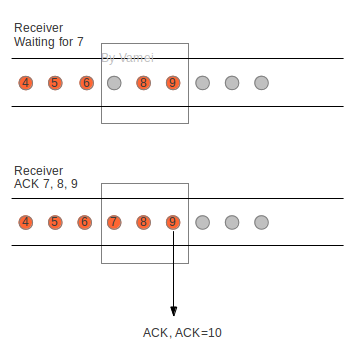
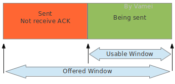
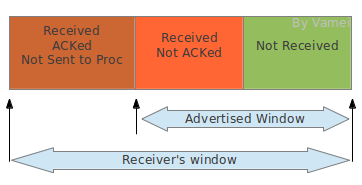

# 魔鬼细节 (TCP滑窗管理)

在TCP协议与"流"通信中，我们建立了滑窗(sliding
window)的基本概念。通过滑窗与ACK的配合，我们一方面实现了TCP传输的可靠性，另一方面也一定程度上提高了效率。其工作方式如下面的视频所示：

如果视频加载有问题，可点下面链接： http://v.youku.com/v_show/id_XNDg1NDUyMDUy.html

然而，之前的解释只是概念性的。TCP为了达到更好的传输效率，对上面的工作方式进行了许多改进。The devil is in the details.
我们需要深入到细节，才能看清楚TCP协议的智慧所在。

## 累计ACK

在TCP连接中，我们通过将ACK回复“附着”在其他数据片段的方式，减少了ACK回复所消耗的流量。但这并不是全部的故事。TCP协议并不是对每个片段都发送ACK回复。TCP协议实际采用的是累计ACK回复(accumulative
acknowledgement)。接收方往往利用一个ACK回复来知会连续多个片段的成功接收。通过累计ACK，所需要的ACK回复通常可以降到50%。

如下图所示，橙色为已经接收的片段。方框为滑窗，滑窗可容纳3个片段。

滑窗还没接收到片段7时，已接收到片段8，9。这样就在滑窗中制造了一个“空穴”(hole)。当滑窗最终接收到片段7时，滑窗送出一个回复号为10的ACK回复。发送方收到该回复，会意识到，片段10之前的片段已经按照次序被成功接收。整个过程中节约了片段7和片段8所需的两个ACK回复。

此外，接收方在接收到片断，并应该回复ACK的时候，会故意延迟一些时间。如果在延迟的时间里，有后续的片段到达，就可以利用累计ACK来一起回复了。

 

## 滑窗结构
在之前的讨论中，我们以片段为单位，来衡量滑窗的大小的。真实的滑窗是以byte为单位表示大小，但这并不会对我们之前的讨论造成太大的影响。

发送方滑窗可以分为下面两个部分。offered window为整个滑窗的大小。

接收方滑窗可分为三个部分：

 

可以看到，接收方的滑窗相对于发送方的滑窗多了一个`Received; ACKed; Not Sent to
Proc`的部分。接收方接收到的文本流必须等待进程来读取。如果进程正忙于做别的事情，那么这些文本流即使已经正确接收，还是需要暂时占用接收缓存。当出现上述占用时，滑窗的可用部分(也就是图中advertised
window)就会缩水。这意味着接收方的处理能力下降。如果这个时候发送方依然按照之前的速率发送数据给接收方，接收方将无力接收这些数据。

## 流量控制

TCP协议会根据情况自动改变滑窗大小，以实现流量控制。流量控制(flow control)是指接收方将advertised
window的大小通知给发送方，从而指导发送方修改offered window的大小。接收方将该信息放在TCP头部的window size区域：

发送方在收到window size的通知时，会调整自己滑窗的大小，让offered window和advertised
window相符。这样，发送窗口变小，文本流发送速率降低，从而减少了接收方的负担。

## 零窗口
advertised window大小有可能变为0，这意味着接收方的接收能力降为0。发送方收到大小为0的advertised window通知时，停止发送。

零窗口

当接收方经过处理，再次产生可用的advertised
window时，接收方会通过纯粹的ACK回复来通知发送方，让发送方恢复发送。然而，ACK回复的传送并不是可靠的。如果该ACK回复丢失，那么TCP传输将陷入死锁(deadlock)状态。

为此，发送方会在零窗口后，不断探测接收方的窗口。窗口探测(window probe)时，发送方会向接收方发送包含1
byte文本流的TCP片段，并等待ACK回复(该ACK回复包含有window size)。由于有1
byte的数据存在，所以该传输是可靠的，而不用担心ACK回复丢失的问题。如果探测结果显示窗口依然为0，发送方会等待更长的时间，然后再次进行窗口探测，直到TCP传输恢复。

## 白痴窗口综合症
滑窗机制有可能犯病，比如白痴窗口综合症 (Silly Window
Syndrome)。假设这样一种情形：接收方宣布(advertise)一个小的窗口，发送方根据advertised
window，发送一个小的片段。接收方的小窗口被填满，经过处理，接收方再宣布一个小的窗口……
这就是“白痴窗口综合症”：TCP通信的片段中包含的数据量很小。在这样的情况下，TCP通信的片段所含的信息都很小，网络流量主要是TCP片段的头部，从而造成流量的浪费
(由于TCP头部很大，我们希望每个TCP片段中含有比较多的数据)。

如果发送方不断发送小的片段，也会造成“白痴窗口”。为了解决这个问题，需要从两方面入手。TCP中有相关的规定，要求：

1. 接收方宣告的窗口必须达到一定的尺寸，否则等待。
2. 除了一些特殊情况，发送方发送的片段必须达到一定的尺寸，否则等待。特殊情况主要是指需要最小化延迟的TCP应用(比如命令行互动)。

## 总结

累计ACK减少了TCP传输过程中所需的ACK流量。通过流量管理，TCP连接两端的工作能力可以匹配，从而减少不不要的传输浪费。累计ACK和流量控制都是TCP协议的重要特征。

TCP协议相当复杂，并充斥着各种细节。然而TCP协议又是如此重要的一个协议，引领风骚三十年，可以说是互联网的奇迹。这些细节正是TCP协议成功的原因，并值得我们深入了解。
