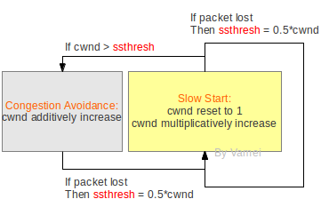

# 天下为公 (TCP堵塞控制)

在TCP协议中，我们使用连接记录TCP两端的状态，使用编号和分段实现了TCP传输的有序，使用advertised
window来实现了发送方和接收方处理能力的匹配，并使用重复发送来实现TCP传输的可靠性。我们只需要将TCP片段包装成IP包，扔到网络中就可以了。TCP协议的相关模块会帮我们处理各种可能出现的问题(比如排序，比如TCP片段丢失等等)。最初的TCP协议就是由上述的几大块构成的。

然而进入上世纪八十年代，网络开始变的繁忙。许多网络中出现了大量的堵塞(congestion)。堵塞类似于现实中的堵车。网络被称为“信息高速公路”。许多汽车(IP包)在网络中行驶，并经过一个一个路口
(路由器)，直到到达目的地。一个路由器如果过度繁忙，会丢弃一些IP包。UDP协议不保证传输的可靠性，所以丢失就丢失了。而TCP协议需要保证传输的可靠性，当包含有TCP片段的IP包丢失时，TCP协议会重复发送TCP片段。于是，更多的“汽车”进入到公路中，原本繁忙的路由器变得更加繁忙，更多的IP包丢失。这样就构成了一个恶性循环。这样的情况被称为堵塞崩溃(congestion collapse)。每个发送方为了保证自己的发送质量，而不顾及公共领域现状，是造成堵塞崩溃的主要原因。当时的网络中高达90%的传输资源可能被堵塞崩溃所浪费。

为了解决这一缺陷，从八十年代开始，TCP协议中开始加入堵塞控制(congestion
control)的功能，以避免堵塞崩溃的出现。多个算法被提出并实施，大大改善了网络的交通状况。直到今天，堵塞控制依然是互联网研究的一个活跃领域。

## 公德

现实中，当我们遇到堵车，可能就会希望兴建立交桥和高架，或者希望有一位交警来疏导交通。而TCP协议的堵塞控制是通过约束自己实现的。当TCP的发送方探测到网络交通拥堵时，会控制自己发送片段的速率，以缓解网络的交通状况，避免堵塞崩溃。简言之，TCP协议规定了发送方需要遵守的“公德”。

我们先来说明堵塞是如何探测的。在TCP重新发送中，我们已经总结了两种推测TCP片段丢失的方法：ACK超时和重复ACK。一旦发送方认为TCP片段丢失，则认为网络中出现堵塞。

另一方面，TCP发送方是如何控制发送速率呢？TCP协议通过控制滑窗(sliding
window)大小来控制发送速率。在TCP滑窗管理中，我们已经见到了一个窗口限制，就是advertised window
size，以实现TCP流量控制。TCP还会维护一个堵塞窗口
大小，以根据网络状况来调整滑窗大小。真实滑窗大小取这两个滑窗限制的最小值，从而同时满足两个限制 (流量控制和堵塞控制)。

 advertised window vs congestion window

我们将专注于堵塞窗口。(Hulk，smash!)

## 堵塞窗口

堵塞窗口(congestion window)总是处于两种状态的一个。这两种状态是: 慢启动(slow start)和堵塞规避(congestion avoidance)。

上图是概念性的。实际的实施要比上图复杂，而且根据算法不同会有不同的版本。cwnd代表堵塞窗口大小。我们以片段的个数为单位，来表示cwnd的大小 (同样是概念性的)。

堵塞窗口从慢启动的状态开始。慢启动的特点是初始速率低，但速率不断倍增。每次进入到
慢启动状态时，cwnd都需要重置为初始值1。发送方每接收到一个正确的ACK，就会将堵塞窗口增加1，从而实现速率的倍增(由于累计ACK，速率增长可能会小于倍增)。

当堵塞窗口的大小达到某个阈值ssthresh时，congestion进入到堵塞规避(congestion
avoidance)状态。发送速率会继续增长。发送方在每个窗户所有片段成功传输后，将窗口尺寸增加1(实际上就是每个RTT增加1)。所以在堵塞规避状态下，cwnd线性增长，增长速率慢。

如果在堵塞规避下有片段丢失，重新回到慢启动状态，并将ssthresh更新为cwnd的一半。

我们看到，sshthresh是慢启动到堵塞规避的切换点。而片段丢失是堵塞规避到慢启动的切换点。一开始sshthresh的值一般比较大，所以慢启动可能在切换成堵塞规避之前就丢失片段。这种情况下，慢启动会重新开始，而ssthresh更新为cwnd的一半。

总的来说，发送速率总是在增长。如果片段丢失，则重置速率为1，并快速增长。增长到一定程度，则进入到慢性增长。快速增长和慢性增长的切换点(sshthred)会随着网络状况(何时出现片段丢失)更新。通过上面的机制，让发送速率处于动态平衡，不断的尝试更大值。初始时增长块，而接近饱和时增长慢。但一旦尝试过度，则迅速重置，以免造成网络负担。

## 总结

阻塞控制有效的提高了互联网的利用率。阻塞控制的算法多种多样，并且依然不完善。一个常见的问题是cwnd在接近饱和时线性增长，因此对新增的网络带宽不敏感。

互联网利用“公德”来实现效率。“公德”和效率似乎可以并存。

到现在为止，TCP协议的介绍就可以告一段落了。可以回想一下TCP的几大模块：分段与流，滑窗，连接，流量控制，重新发送，堵塞控制。
